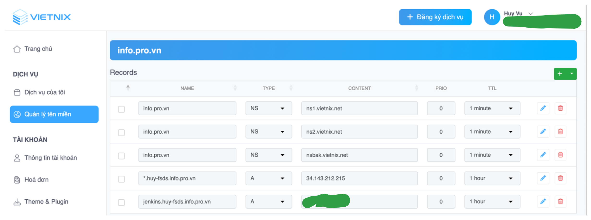
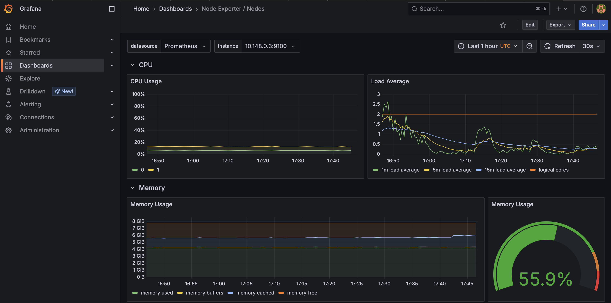
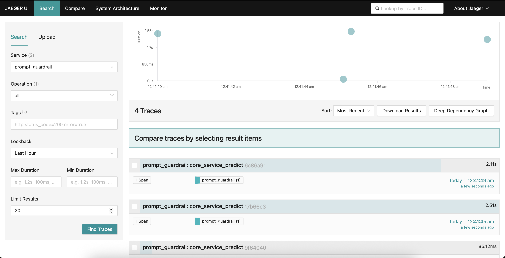
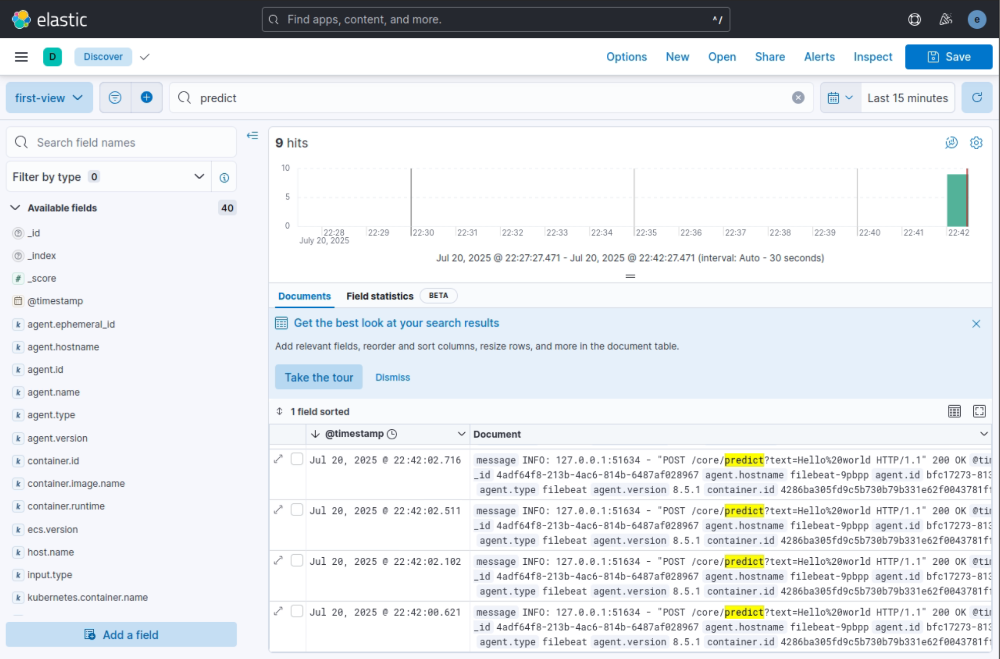
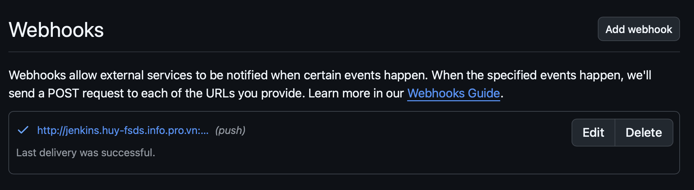
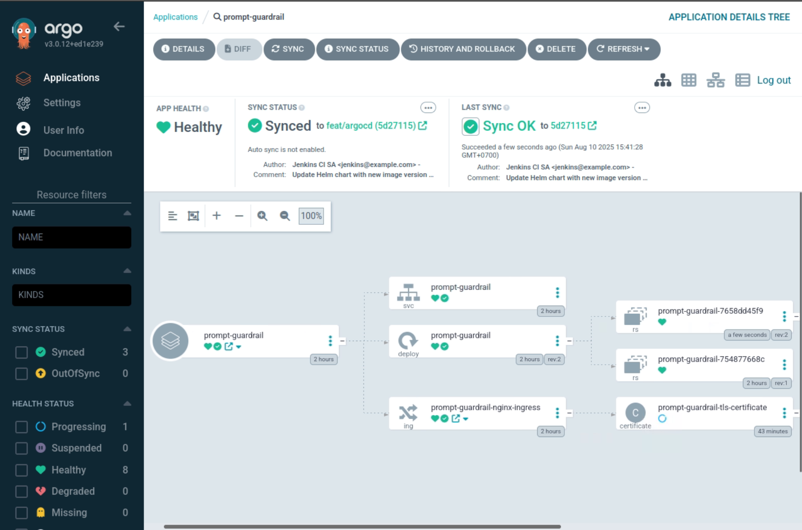

# 🚀 Prompt Guardrail Service

## 📚 Table of Contents

1. [🗺️ System Architecture with Kubernetes](#1-system-architecture-with-kubernetes)
2. [🖥️ Local Deployment with Docker Compose](#2-local-deployment-with-docker-compose)
3. [☁️ Provisioning Infrastructure on Google Cloud with Terraform](#3-provisioning-infrastructure-on-google-cloud-with-terraform)
4. [📦 Deploying Service on GKE Cluster](#4-deploying-service-on-gke-cluster)
5. [🔄 Setup CI/CD](#5-setup-cicd)

---

## 🗺️ 1. System Architecture with Kubernetes

Welcome to the architectural blueprint of our system! This section provides an overview of how we orchestrate services using Kubernetes, ensuring scalability, resilience, and observability.


---

## 🖥️ 2. Local Deployment with Docker Compose

Set up and test the Prompt Guardrail Service locally with Docker Compose. This enables developers to experience the full stack, including observability and logging tools, right from their workstation.

### Step 1: Prepare Environment Variables

Create a `.env` file in the `api` directory, based on `.env.example`:

```env
OLTP_ENDPOINT="grpc://otel-collector:4317"
OLTP_INSECURE=true
SERVICE_NAME="prompt_guardrail"
```

### Step 2: Launch Services

```bash
docker compose up -d
```

### Step 3: Services Launched

1. **api**: API service, available at `http://localhost:12345/docs`.
2. **otel-collector**: Observability collector.
3. **jaeger**: Trace visualizer at `http://localhost:16686`.
4. **prometheus**: Metrics collector.
5. **grafana**: Metrics visualization.
6. **node\_exporter**: System metrics exporter.

### Step 4: Launch Logging Server

```bash
cd elk
docker-compose -f docker-compose.yml -f extensions/filebeat/filebeat-compose.yml up
```

---

## ☁️ 3. Provisioning Infrastructure on Google Cloud with Terraform

This section walks you through provisioning cloud infrastructure on Google Cloud using Terraform. Automate your cloud setup with IaC best practices!

### Prerequisites

- Install **Terraform**: [Guide](https://computingforgeeks.com/how-to-install-terraform-on-ubuntu/)
- Authenticate to Google Cloud:

```bash
gcloud auth application-default login
```

### Provisioning Steps

Before provisioning resources, edit these information in 
1. project_id: Change default value with you google cloud project-id.
2. ssh_keys: Generate your news ssh keys, replace the default value with your public key. This parameter uses for connectin ssh to VM from you local machine. (huyvu2001 is username, change it too!)

Then, provisioning your cloud resources.
```bash
cd iac/terraform
terraform init
terraform plan
terraform apply
```

### Provisioned Resources

- ✅ GKE Cluster (3 nodes)
- ✅ Jenkins VM
- ✅ Firewall Rules

### Access Cluster & VM

```bash
gcloud container clusters get-credentials <your_project_id>-gke --zone asia-southeast1-a --project <your_project_id>
ssh huyvu2001@35.247.183.230
```

---

## 📦 4. Deploying Service on GKE Cluster

Deploy services to a GKE Cluster with organized namespaces, ensuring a production-ready environment.

### Namespaces Overview

- 📦 **model-serving**: API app.
- 📈 **monitoring**: Observability tools.
- 🌐 **nginx-system**: Ingress controller.
- 📊 **logging**: Logging stack.
- 📈 **cert-manager**: Cert manager app.
- 📦 **argocd**: ArgoCD manages CD pipeline.

### a. Deploy NGINX Ingress

```bash
kubectl create namespace nginx-system
./scripts/nginx-system.sh
```

Then, run the script below to get the nginx service IP address
```
source ./scripts/nginx-system-ip.sh
```

After this steps, we would go to Vietnix, set the DNS record with IP address. If you have domain (and you should to work with our project), you should do that too.


### b. Deploying Cert Manager app
__Overview__: Cert-manager is a service that manages SSL certificate, solves SSL challenge from Let's Encrypt and so on. Before start the service, we create all other service's namespaces, since we would create Certificate object for each namespace.

```bash
# Create namespace
kubectl create namespace model-serving
kubectl create namespace monitoring
kubectl create namespace logging
kubectl create namespace argocd

# Start the service
kubectl create namespace cert-manager
./scripts/cert-manager.sh
```

### b. Deploy Prompt Guardrail Service

```bash
kubectl create namespace model-serving
./scripts/model-serving.sh
```

If the Certificate in a namepsace issues certificate successfully, it's READY should be "True"
```bash
# Check certificate in model-serving
kubectl get Certificate --namespace model-serving

# Result
NAME                               READY   SECRET                             AGE
prompt-guardrail-tls-certificate   True    prompt-guardrail-tls-certificate   160m
```

The secret that goes along with the Certificate contains SSL certificate and its private key. In each of the service's ingress object, they would reference this secret to do TLS termination.

```yaml
# helm/prompt-guardrail/templates/nginx-ingress.yaml
...
spec:
  ingressClassName: nginx
  tls:
  - hosts:
      - {{ .Values.ingress.host }}
    secretName: prompt-guardrail-tls-certificate
...
```

### c. Deploy Otel Collector

```bash
./scripts/otel-collector.sh
```

### d. Deploy Prometheus Stack
Overview: Prometheus is a metrics collector, and Grafana is a metrics visualizer. We would use Prometheus to collect metrics from our app, and Grafana to visualize them. After running this script, it would deploy Prometheus, Grafana, and Node Exporter (a system metrics exporter).
```bash
kubectl create namespace monitoring
./scripts/prometheus-stack.sh
```

You can access grafana through `https://grafana.huy-fsds.info.pro.vn`. The account should be:
- Username: `huyvu`
- Password: `huyvu_grafana_2025`
You can change the username and password in the script above at `helm/kube-promtheus-stack/values.yaml:`
```yaml
grafana:
    adminUser: huyvu
    adminPassword: huyvu_grafana_2025
```



### f. Deploy Jaeger
Overview: In this probject, we use Jaeger in all-in-one mode, where traces are stored in memory. This is suitable for development and testing purposes, but not recommended for production use.
```bash
./scripts/jaeger.sh
```

Then, you can access Jaeger UI through `https://jaeger.huy-fsds.info.pro.vn`. No authentication is required.



### g. Elasticsearch Stack
Overview: ELK stack is a set of tools for logging and searching logs. It includes Elasticsearch, Kibana, and Filebeat. We would use Filebeat to collect logs from our app, and Elasticsearch to store them. Kibana is used to visualize the logs.

In the folder `scripts/ELK`, we have the scripts to deploy Elasticsearch, Kibana, and Filebeat. The script would create a secret named `elasticsearch-credentials` in the `logging` namespace, which contains the password for the `elastic` user.
```bash
# Deploy Elasticsearch
./scripts/ELK/elasticsearch.sh

# Get Elasticsearch password
kubectl get secret elasticsearch-credentials -n logging -o jsonpath='{.data.password}' | base64 --decode

# Deploy Filebeat
./scripts/ELK/filebeat.sh

# Deploy Kibana
./scripts/ELK/kibana.sh
```

Then, you can access Kibana through `https://kibana.huy-fsds.info.pro.vn`. The default username is `elastic`, and the password is the one you retrieved earlier from the secret.


---

## 🔄 5. Setup CI

Overview: We would deploy Jenkins on a VM, and use it to test, build, and update Helm Chart for our app. Jenkins would be configured to pull source code from GitHub, build Docker image, and push it to a private registry. Then, it would update the Helm Chart with the new image tag, and ArgoCD would automatically synchronize with the new Helm Chart. 

### a. Install Jenkins on VM

First, connect ssh to your VM. Replace the domain below with your Jenkins public IP address.

```bash
ssh huyvu2001@jenkins.huy-fsds.info.pro.vn
```

Since we deploy Jenkins by docker, installing docker cli with below command
```
curl https://get.docker.com > dockerinstall && chmod 777 dockerinstall && ./dockerinstall
```

Create a new file docker-compose.yml from that at `jenkins/docker-compose.yml`. In this docker compose, we use a docker image, built from jenkins/Dockerfile, which has installed docker-cli. We also mount the docker daemon socket to the container, so that Jenkins can use the docker CLI to build and push Docker images:
```
docker compose up -d
```

Access you jenkins through your VM public IP Address. In my case, I would create a A DNS record, and access it through `jenkins.huy-fsds.info.pro.vn:8081`. 


Jenkins requires you to authenticate. The default username is `admin`, and run the below command to get your password:
```bash
docker exec -it jenkins /bin/bash
cat /var/jenkins_home/secrets/initialAdminPassword
```

Then, configuring the new public access key to your github account follow this tutorial: [Adding a new SSH key to your GitHub account](https://docs.github.com/en/authentication/connecting-to-github-with-ssh/adding-a-new-ssh-key-to-your-github-account)


After login, click install suggested plugins to complete you setup.

Then, you need to do the following plugins. Go to Manage Jenkins → Manage Plugins → Available, and search for the following plugins:
- Git plugin.
- Docker pipeline: Use for building the docker image.


### b. Setup Webhooks
Go to your github repository, Settings -> Webhooks → Add webhook
1. Payload URL: `http://jenkins.huy-fsds.info.pro.vn:8081/github-webhook/`
2. Content type: `application/json`
3. Select events: `Let me select individual events.` and check `Pull request`, `Push`, `Branch or tag creation`, `Branch or tag deletion`.

If you want to test the webhook, you can push a commit to your repository, and check the webhook delivery status in GitHub. It should return a 200 OK status.



### c. Create Github Access Token
Go to your GitHub account, Settings → Developer settings → Personal access tokens → Tokens (classic) → Generate new token
1. Note: Give your token a name.
2. Expiration: Set the expiration date for your token.
3. Select scopes: Check `repo` and `workflow` scopes.
4. Click Generate token.

Copy the generated token, and save it in a safe place. You would need this token to authenticate Jenkins to pull source code from your GitHub repository.

### d. Create Docker Access Token & Jenkins Docker Credentials
If you use a private Docker registry, you need to create an access token to authenticate Jenkins to pull and push Docker images. The steps to create a Docker access token depend on the registry you are using. Save the token in a safe place, as you would need it to configure Jenkins.

Go to Jenkins → Manage Jenkins → Manage Credentials → System → Global credentials (unrestricted) → Add Credentials
1. Kind: Username with password.
2. Scope: Global.
3. Username: Your Docker registry username.
4. Password: Your Docker access token.

### e. Create SSH Github Access token & Jenkins SSH Credentials
If you want Jenkins to be able to push changes back to your GitHub repository, you need to create an SSH access token. This is the same SSH key you created earlier. You need to add the public key to your GitHub account, and configure Jenkins to use the private key.

To generate the private key, you can use the command below:
Create a ssh key using the command below:
```bash
ssh-keygen -t rsa -b 4096 -C "your_email@example.com"
```

Create a public SSH key on github hub follow this tutorial: [Connecting to GitHub with SSH](https://docs.github.com/en/authentication/connecting-to-github-with-ssh).

Then, go to Jenkins → Manage Jenkins → Manage Credentials → System → Global credentials (unrestricted) → Add Credentials
1. Kind: SSH Username with private key.
2. Scope: Global.
3. Username: Your GitHub username.
4. Private Key: Enter directly, and paste your private key.

### f. Create Jenkins Multibranch Pipeline
Go to Jenkins → New Item → Multibranch Pipeline
1. Name: Your pipeline name.
2. Branch Sources: Add a new github branch source, you would require to enter your GitHub repository URL and Github credentials (you can create a new one with your GitHub access token).
3. Build Configuration: change path Jenkins file to `jenkins/Jenkinsfile`.
4. Properties: Add Docker credentials, which you created earlier, and SSH credentials.
5. Save your pipeline.


Push a commit to your repository, and Jenkins would automatically detect the changes, and start building your pipeline. You can check the build status in Jenkins.

(*) Comment: When creating Credentials, name the Credential ID since you would reference it in your Jenkinsfile.
Here we set our credential ids as:
- `github-private-key`: SSH private key for GitHub.
- `dockerhub-credentials`: Docker credentials for private registry.

### c. Create CD Pipeline with ArgoCD

Overview: In this section, we would discuss how to connect ArgoCD to our repository, and synchronize with our app.

Run the script below to deploy ArgoCD:
```bash
./scripts/argocd.sh
```

Go to your ArgoCD UI, which is available at `https://argocd.huy-fsds.info.pro.vn`. The default username is `admin`, run the command below to get your password:
```bash
kubectl -n argocd get secret argocd-initial-admin-secret -o jsonpath="{.data.password}" | base64 -d
```

__Step 1: Connecting to a repository__: Go to settings → Repository → Connect Repo

1. Connection method: HTTP/HTTPS.
2. Name: Repository name.
3. Project: Default.
4. Repository URL: https://github.com/VuHuy-cse-9/prompt-gruardrail-serving-model.git
5. Password: Github Access Token.
6. Click Create.

__Step 2: Create an application__: Go to ArgoCD Applications → Create App

1. Application name: You app name, this would be the same as release name.
2. Project name: Default.
3. Sync policy: there are two modes:
    - Manual: When ArgoCD notices you app is different from that in Repo → Turn on a warning (For production stage).
    - Auto-Sync: Automatically synchronize with you app (For development stage)
4. Source:
    - Repository URL: Save as above.
    - Revision: Select branch that ArgoCD would synchronize with.
    - Path: Path to Helm Chart Repo (It would automatically detect and recommend for you).
5. Destination:
    - Cluster URL: https://kubernetes.default.svc
    - Namespace: Namespace that we would deploy the app.
6. Other: It would let you select your value file name, and automatically detect you image tag.



After that, you would know whether your app has already been synced with that on repo, and ArgoCD would notice you.

---

🎉 **You're all set! Your Jenkins pipeline is now ready to build and deploy your Prompt Guardrail Service!**


