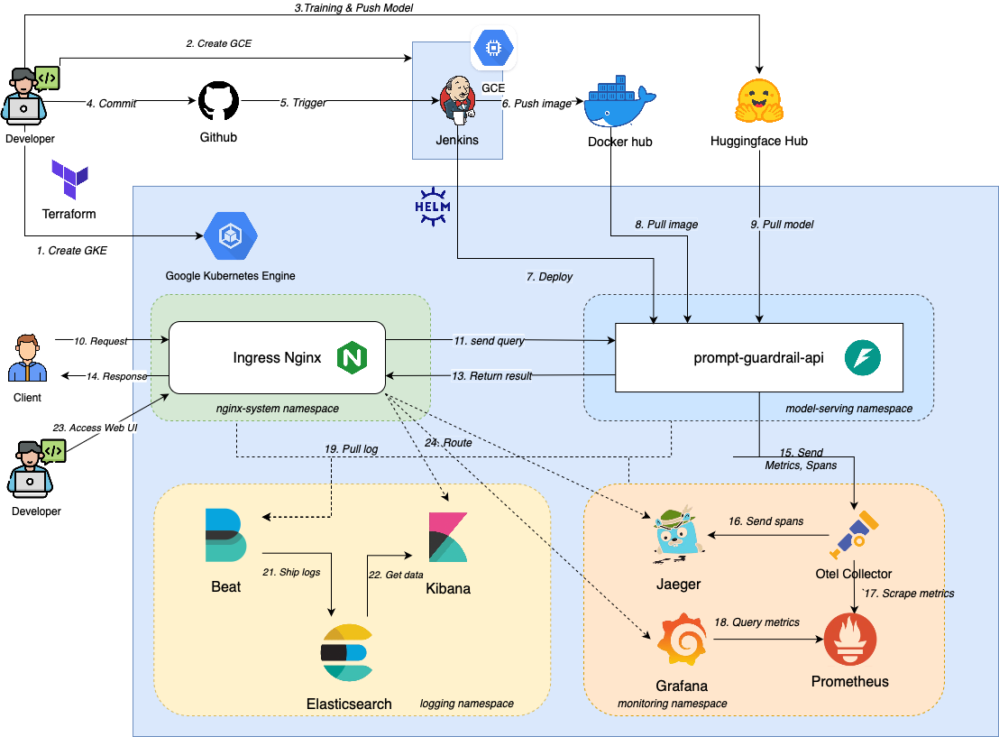

# 🚀 Prompt Guardrail Service

## 📚 Table of Contents

1. [🗺️ System Architecture with Kubernetes](#1-system-architecture-with-kubernetes)
2. [🖥️ Local Deployment with Docker Compose](#2-local-deployment-with-docker-compose)
3. [☁️ Provisioning Infrastructure on Google Cloud with Terraform](#3-provisioning-infrastructure-on-google-cloud-with-terraform)
4. [📦 Deploying Service on GKE Cluster](#4-deploying-service-on-gke-cluster)
5. [🔄 Setup CI/CD](#5-setup-cicd)

---

## 🗺️ 1. System Architecture with Kubernetes

Welcome to the architectural blueprint of our system! This section provides an overview of how we orchestrate services using Kubernetes, ensuring scalability, resilience, and observability.




---

## 🖥️ 2. Local Deployment with Docker Compose

Set up and test the Prompt Guardrail Service locally with Docker Compose. This enables developers to experience the full stack, including observability and logging tools, right from their workstation.

### Step 1: Prepare Environment Variables

Create a `.env` file in the `api` directory, based on `.env.example`:

```env
OLTP_ENDPOINT="grpc://otel-collector:4317"
OLTP_INSECURE=true
SERVICE_NAME="prompt_guardrail"
```

### Step 2: Launch Services

```bash
docker compose up -d
```

### Step 3: Services Launched

1. **api**: API service, available at `http://localhost:12345/docs`.
2. **otel-collector**: Observability collector.
3. **jaeger**: Trace visualizer at `http://localhost:16686`.
4. **prometheus**: Metrics collector.
5. **grafana**: Metrics visualization.
6. **node\_exporter**: System metrics exporter.

### Step 4: Launch Logging Server

```bash
cd elk
docker-compose -f docker-compose.yml -f extensions/filebeat/filebeat-compose.yml up
```

---

## ☁️ 3. Provisioning Infrastructure on Google Cloud with Terraform

This section walks you through provisioning cloud infrastructure on Google Cloud using Terraform. Automate your cloud setup with IaC best practices!

### Prerequisites

- Install **Terraform**: [Guide](https://computingforgeeks.com/how-to-install-terraform-on-ubuntu/)
- Authenticate to Google Cloud:

```bash
gcloud auth application-default login
```

### Provisioning Steps

Before provisioning resources, edit these information in 
1. project_id: Change default value with you google cloud project-id.
2. ssh_keys: Generate your news ssh keys, replace the default value with your public key. This parameter uses for connectin ssh to VM from you local machine. (huyvu2001 is username, change it too!)

Then, provisioning your cloud resources.
```bash
cd iac/terraform
terraform init
terraform plan
terraform apply
```

### Provisioned Resources

- ✅ GKE Cluster (3 nodes)
- ✅ Jenkins VM
- ✅ Firewall Rules

### Access Cluster & VM

```bash
gcloud container clusters get-credentials <your_project_id>-gke --zone asia-southeast1-a --project <your_project_id>
ssh huyvu2001@35.247.183.230
```

---

## 📦 4. Deploying Service on GKE Cluster

Deploy services to a GKE Cluster with organized namespaces, ensuring a production-ready environment.

### Namespaces Overview

- 📦 **model-serving**: API app.
- 📈 **monitoring**: Observability tools.
- 🌐 **nginx-system**: Ingress controller.
- 📊 **logging**: Logging stack.

### a. Deploy NGINX Ingress

```bash
kubectl create namespace nginx-system
./scripts/nginx-system.sh
```

Then, run the script below to get the nginx service IP address
```
source ./scripts/nginx-system-ip.sh
```
Save the external ip somewhere to access to other service.

### b. Deploy Prompt Guardrail Service

```bash
kubectl create namespace model-serving
./scripts/model-serving.sh
```

Then, you can access your service through `app.$EXTERNAL_IP.nip.io`

### c. Deploy Otel Collector

```bash
./scripts/otel-collector.sh
```

### d. Deploy Prometheus Stack

```bash
kubectl create namespace monitoring
./scripts/prometheus-stack.sh
```


### e. Access Grafana

You can access grafana through `grafana.$EXTERNAL_IP.nip.io`

- Username: `huyvu`
- Password: `huyvu_grafana_2025`

### f. Deploy Jaeger

```bash
./scripts/jaeger.sh
```

Then, you can access Jaeger UI through `jaeger.$EXTERNAL_IP.nip.io`

### g. Elasticsearch Stack

```bash
kubectl create namespace logging
./scripts/ELK/elasticsearch.sh
kubectl get secret elasticsearch-credentials -n logging -o jsonpath='{.data.password}' | base64 --decode
./scripts/ELK/kibana.sh
./scripts/ELK/filebeat.sh
```

Then, you can access Kibana through `kibana.$EXTERNAL_IP.nip.io`

Login to Kibana with:

- Username: `elastic`
- Password: (retrieved earlier)

Run service requests and search `predict` in Kibana logs.


---

## 🔄 5. Setup CI/CD

Automate build, test, and deployment processes with Jenkins integrated into your GKE cluster.

### a. Install Jenkins

Replace the domain below with your Jenkins public IP address.

```bash
ssh huyvu2001@jenkins.huy-fsds.info.pro.vn
```

Installing docker cli with below command
```
curl https://get.docker.com > dockerinstall && chmod 777 dockerinstall && ./dockerinstall
```

You may need to follow those post processing steps from this link: [docker/post-process](https://docs.docker.com/engine/install/linux-postinstall/)

Create a new file docker-compose.yml with that at `jenkins/docker-compose.yml`, then run:
```
docker compose up -d
```

Access you jenkins through your VM public IP Address: `jenkins.huy-fsds.info.pro.vn:8081`. The default username is admin, and run the below command to get your password:
```
docker exec -it jenkins /bin/bash
cat /var/jenkins_home/secrets/initialAdminPassword
```

After login, click install suggested plugins to complete you setup.

### b. Connect Jenkins to GKE

```bash
kubectl create ns model-serving
kubectl create clusterrolebinding model-serving-admin-binding --clusterrole=admin --serviceaccount=model-serving:default --namespace=model-serving
kubectl create clusterrolebinding anonymous-admin-binding --clusterrole=admin --user=system:anonymous --namespace=model-serving
```

### c. Create CI/CD Pipeline

- Create GitHub token.
- Set up Jenkins Multibranch Pipeline.
- Configure GitHub Webhook:

```bash
http://<VM_External_IP>:8081/github-webhook/
```

### d. Docker Credentials for Private Images

If using private Docker images, set up credentials in Jenkins:

1. Create a Docker access token.
2. Add credentials in Jenkins Global Credentials with ID `docker-hub-credentials`.

---

🎉 **You're all set! Your Jenkins pipeline is now ready to build and deploy your Prompt Guardrail Service!**


