# Prompt Guardrail Service

## Table of Contents

[1. System architecture with Kubernetes](#1-system-architecture-with-kubernetes-k8s)

[2. Local Deployment with docker compose](#2-local-deployment-with-docker-compose)

[3. Provisioning Infrastructure on Google Cloud with Terraform](#3-provisioning-infrastructure-on-google-cloud-with-terraform)

[4. Deploying service on GKE cluster](#4-deploying-service-on-gke-cluster)

[5. Setup CI/CD](#5-setup-cicd)


## 1. System architecture with Kubernetes
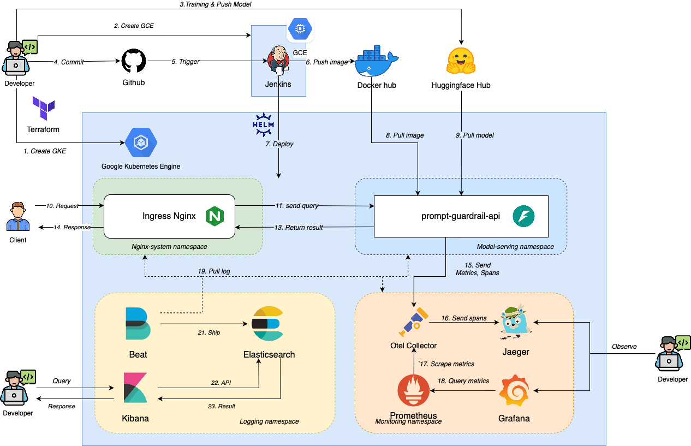

## 2. Local Deployment with docker compose

Create `.env` file in api, which is given in .env.example
```
OLTP_ENDPOINT="grpc://otel-collector:4317"
OLTP_INSECURE = true
SERVICE_NAME="prompt_guardrail"
```
Where:
- `OLTP_ENDPOINT`: Our api service would push metrics & spans to Otel Collector using this URI. It send through port 4117 since we use gRPC. Since api service and Otel collector is in the same internal network, otel-collector, the name of otel collector's container, is used as a domain name.

- `OLTP_INSECURE`: We don't SSL since they communicate within the same internal network (Same when we deploy on Kubernetes)

- `SERVICE_NAME`: Our api use SERVICE_NAME as an identity so that we can recognize when we view JaegerUI or Grafana.

Launch docker compose
```bash
docker compose up -d
```

After this command, these services would be launched up:
1. api: Our prompt guardrail service. The docker image is built using api/Dockerfile.
2. otel-collector: Otel Collector service.
3. jaeger: Jaeger, recieves spans from otel collector.
4. prometheus: constantly grabs metrics exposed by Otel Collector.
5. grafana: Query metrics from prometheus, exposes them to dashboard.
6. node_exporter: Collect system metrics, exposes them to prometheus.

Now, we would discuss a little bit about how each service work:
**api**: After this service is launched up, it would pull the model's checkpoint from my huggingface hub. The way I trained the model is discussed in notebook folder. After setting up, you can go to `http://localhost:12345/docs`, and try the service.
**otel-collector**: I specify the otel-collector configuration in `monitoring/otel_collector/config.yaml`. In this file, I tell otel collector the URI of jaeger and the port that it should expose for promtheus to grab metrics.
**jaeger**: No configration is required. After it starts up, you can go to `http://localhost:16686` to view it UI. The spans of api should show up after you do several query in api.
**prometheus**: I configure prometheus to collect metrics from otel collector and node-exporter in `monitoring/prometheus/config.yml`.
**grafana**: It's the place for you to visualize metrics collected from promtheus. 

## 3. Provisioning Infrastructure on Google Cloud with Terraform
Overview: In this step, you would provision Google Cloud infrastructure using Terraform. I have setup all the Terraform's configuration at iac/terraform folder.

Before you begin, you should install **terraform** on your machine by following this [guide](https://computingforgeeks.com/how-to-install-terraform-on-ubuntu/).

After that, authenticate you google cloud account using below command:
```bash
gcloud auth application-default login
```

Since we need to ssh to Jenkins VM instance. Generate your public SSH key, and replace ssh_keys default value at `iac/terraform/variables.tf`. 

After everything is completed, run below code to provision you infrastructure.
```bash
cd iac/terraform
terraform init
terraform plan
terraform apply
```

After this command, you would provision GKE to allocate:
1. A Cluster with 3 nodes, each node is a e2-medium with 80GB disk size. These nodes locates at zone: asia-southeast1-a. 
2. A Compute instance: e2-standard-4 for deploying Jenkins. 
3. A firewall allow rules, so that we can access Jenkins from public IP.

Go to Google Cloud Console -> Kubernets Engine -> Cluster, you should see your cluster their. Connect to the cluster using the command below:
```
gcloud container clusters get-credentials <your_project_id>-gke --zone asia-southeast1-a --project <your_project_id>
```

You can able to ssh to the Jenkins instance
```
ssh huyvu2001@35.247.183.230
```

## 4. Deploying service on GKE cluster

**Overview**: In this step, we use Helm to deploy our app in our cluster. These app would be setup on three distinct namespaces: 1. api app would deploy on model-serving namespace, 2. Otel Collector, Jaeger, Prometheus, Grafana, and Node exporter would deploy on monitoring namespace, 3. An ingress controller, so we can access our app by domain.

To launch up the nginx-ingress controller, and monitoring services, run the below scripts:
```
./scripts/nginx-system.sh
./scripts/monitoring.sh
```
Since we would access our service through nginx-ingress controller, we would use nip.io to facilitate of the need of domain name. First, we get the external ip of nginx ingress controller service

```
kubectl ns nginx-system
kubectl get service
```

You should see the EXTERNAL IP of nginx service. Replace that we the default value `host: 34.87.107.6.nip.io` in helm/mychart/templates/nginx-ingress.yaml.

After that, you should start our api service

```
./scripts/model-serving.sh
```

After the service starts up completely, you can access our service at `EXTERNAL_IP.nip.io:8005/docs`.

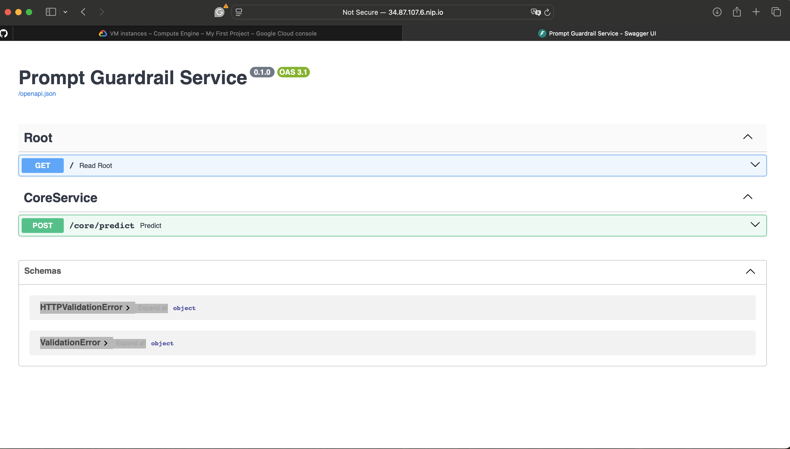

### a. Prometheus

In docker compose, I define a prometheus configuration file at monitoring/promtheus/config.yml. For kubernetes, we would have to do the same thing. We follow the [intruction](https://github.com/prometheus-operator/prometheus-operator/blob/main/Documentation/additional-scrape-config.md) to setup that for promtheus as follow:

Step 1. First, we tell promtheus that it should collect metrics from otel collector by defining a yaml file at `helm/promtheus/promtheus-additional.yaml`. In this file, I show promtheus the URL of Otel collector, which is `otel-collector.monitoring.svc.cluster.local`, FQDN (fully qualified domain name) in Kubernets.

Step 2. Then run the below command:
```
cd helm/prometheus
kubectl create secret generic additional-scrape-configs --from-file=prometheus-additional.yaml --dry-run=client -oyaml > additional-scrape-configs.yaml

kubectl apply -f additional-scrape-configs.yaml -n monitoring
```

Step 3. In order for prometheus to recognize the object you have just created by additional-scrape-configs.yaml, I edit promtheus's object as follow

```
# Final promtheus object
kubectl get promtheus

# Edit it
kubectl edit prometheus <prometheus_name>
```

Step 4: Add the below content as a child of the `spec` key:
```
spec:
  ...
  additionalScrapeConfigs:
    name: additional-scrape-configs
    key: prometheus-additional.yaml
  ...
```


Step 5: Restart the promtheus service
```
helm upgrade --install promt-guardrail-prom-gra prometheus-community/kube-prometheus-stack --namespace monitoring
```

To check whether your setting is correct, use port-forwarding to access prometheus website
```
kubectl port-forward -n monitoring svc/promt-guardrail-prom-gra-k-prometheus 9090:9090
```

Go to target-health, you should see promtheus has connected to otel-collector successfully.
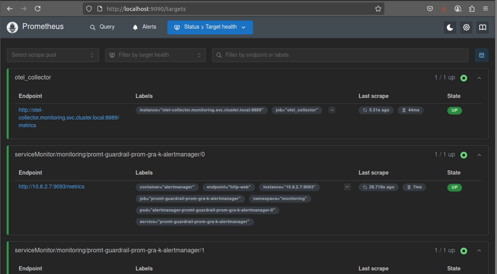

### b. Otel Collector
Overview: we need to tell Otel collector the URI if Jaeger as well as the port it should expose for promtheus to grab. From this [discussion](https://github.com/open-telemetry/opentelemetry-collector-contrib/discussions/31415), I override some of the default value, which is defined at helm/otel_collector/my_values.yaml. I have already applied this value at the `scripts/monitoring.sh`, so we don't have to do anthing.

### c. Grafana:
You can access Grafana service through port-forwarding. First, let see what the Grafana service name through the command:
```
kubectl get service
```
It should be something like `promt-guardrail-prom-gra-grafana`

Run the command below. Then you can access it through localhost:3000
```
kubectl port-forward -n monitoring svc/promt-guardrail-prom-gra-grafana 3000:80
```
The default credentials for Grafana are usually:
- Username: admin
- Password: prom-operator (you should change this immediately)

Go to Grafana home -> Add first data source -> Prometheus, pass the promtheus service FQDN, it should be.
`http://promt-guardrail-prom-gra-k-prometheus.monitoring.svc.cluster.local:9090`. Click save & test to make sure the connection is correct.

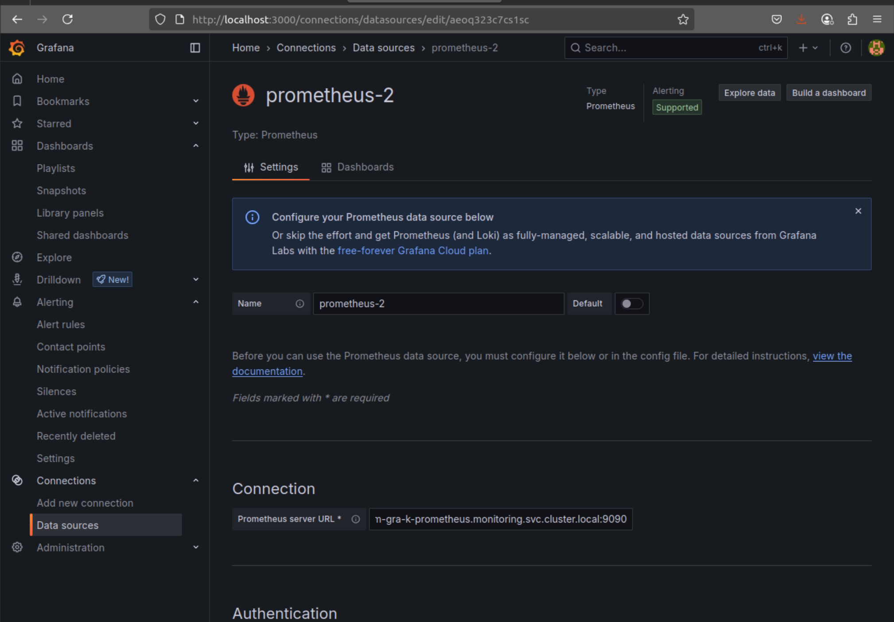

You can view the node system metrics at Dashboard -> Node Exporters/Nodes
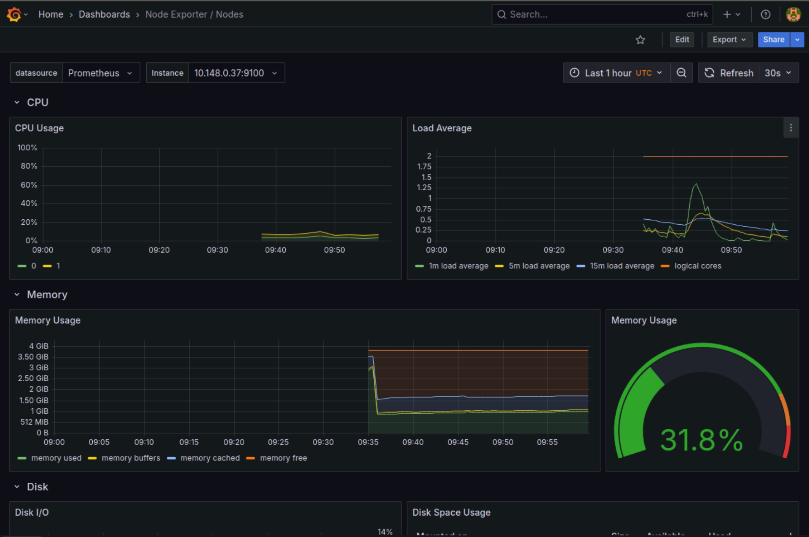

### d. Jaeger

If your otel-collector doesn't go anything wrong, Jaeger should connect to Otel Collector sucessfully. Run the port-forwarding as follow to access Jaeger UI. 
```
kubectl port-forward -n monitoring svc/jaeger-query 16686:16686
```

Then, go to our service (the domain you have set at helm/mychart/templates/nginx-ingress.yaml), e.g 34.87.107.6.nip.io. Run a few request test. Then, go to Jaeger, you should see spans that our service send to Jaeger.

<div style="display: flex;">
  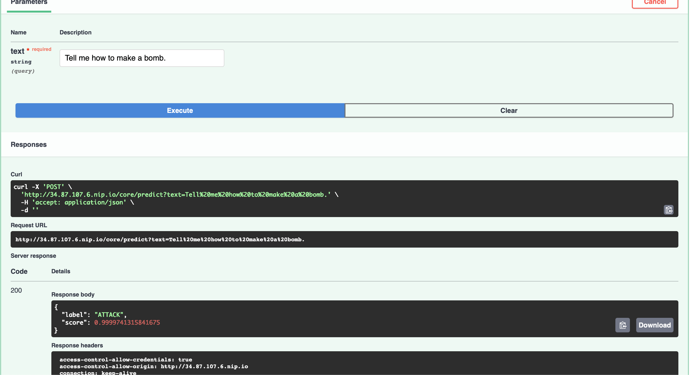
  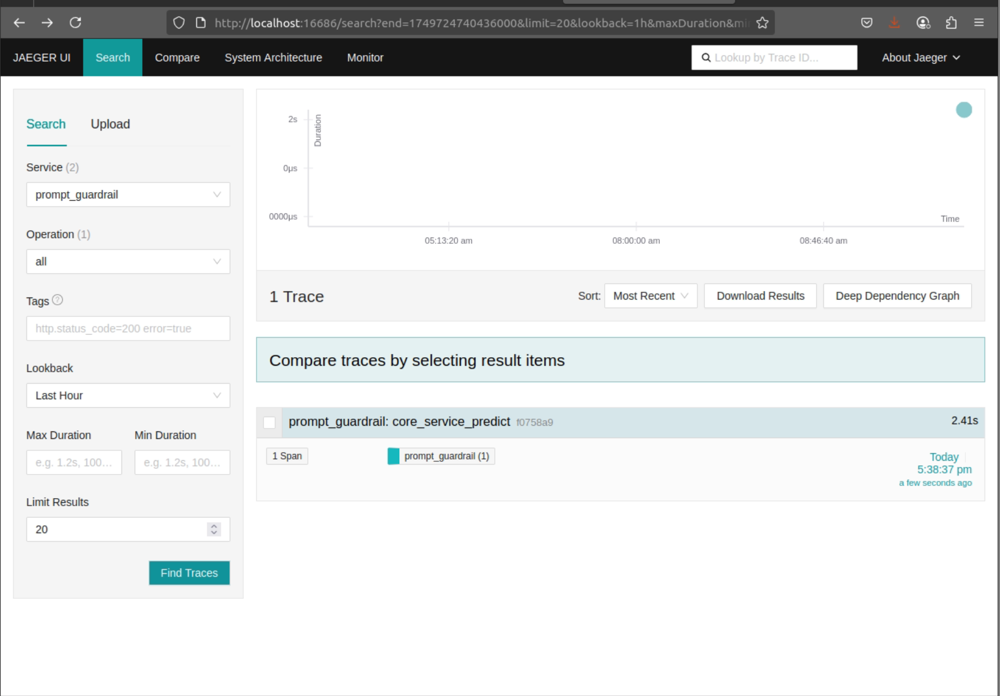
</div>


## 5. Setup CI/CD

### a. Setup Jenkins

First, ssh to Jenkins instance
```
ssh huyvu2001@35.247.183.230
```

After that, install docker following to instructions
1. [Install Docker Engine on Ubuntu](https://docs.docker.com/engine/install/ubuntu/)
2. [Linux post-installation steps for Docker Engine](https://docs.docker.com/engine/install/linux-postinstall/)

Using vim or nano to create a docker-compose.yaml and past the context of that in jenkins/docker-compose.yml. 

We then start up the Jenkins service using docker compose
```
docker compose up -d
```

Execute to jenkins container and install docker:
```
docker exec -it jenkins /bin/bash
curl https://get.docker.com > dockerinstall && chmod 777 dockerinstall && ./dockerinstall
```

After the service starts up completely, you can access Jenkins via <VM_EXTERNAL_IP>:8081. It would require you to give it the password. Return to the terminal that you have already executed in Jenkins container, run the below command to get the password

```
cat /var/jenkins_home/secrets/initialAdminPassword
```

Select install neccessary plugins. Then, completing the setup to get to the Welcome to Jenkins UI.

<div style="display: flex;">
  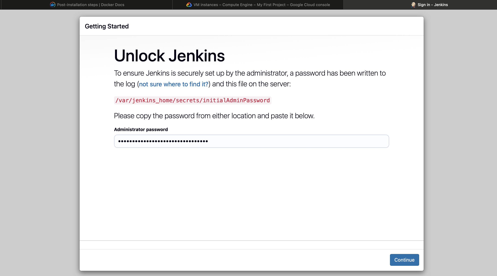
  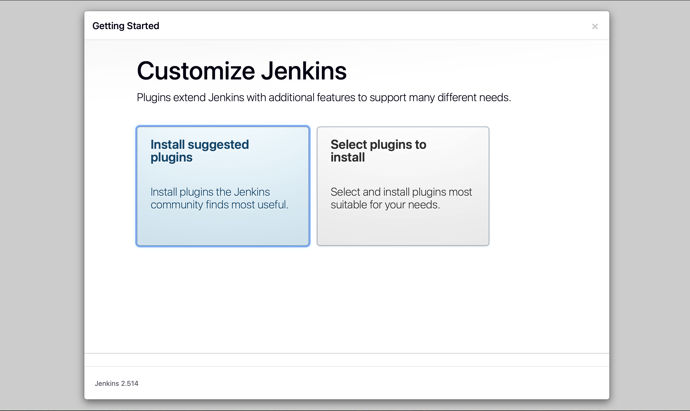
</div>

After that, we need to install neccessary plugins that Jenkins would use for CI/CD. Go to Manage Jenkins -> Plugins -> Available plugins, install Kubernets & Docker pipeline plugins.
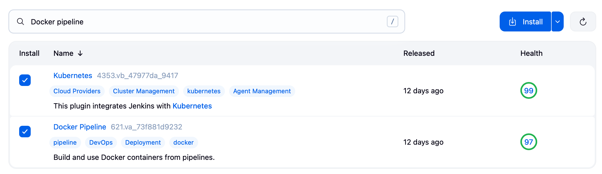

### b. Connect Jenkins to GKE

Open the terminal that has connected to GKE. Create the model-serving namespace (the namespace that Jenkins would access to deplo our app). 
```
kubectl create ns model-serving
```
Then, allow Jenkins's role (system:anynomous) to access Jenkins with admin role.
```
kubectl create clusterrolebinding model-serving-admin-binding \
  --clusterrole=admin \
  --serviceaccount=model-serving:default \
  --namespace=model-serving

kubectl create clusterrolebinding anonymous-admin-binding \
  --clusterrole=admin \
  --user=system:anonymous \
  --namespace=model-serving
```

On the Jenkins UI, Go to Mange Jenkins -> Clouds -> New Cloud, add cloud name and select Kubernetes.

In the next step, we require a 1) GKE External IP, and 2) Kubernetes server certificate key. First, grab you GKE External IP in Google Cloud console -> Kubernetes Engine -> Select you Cluster -> Control Plan Networking -> Copy public endpoint. This is your GKE External IP.
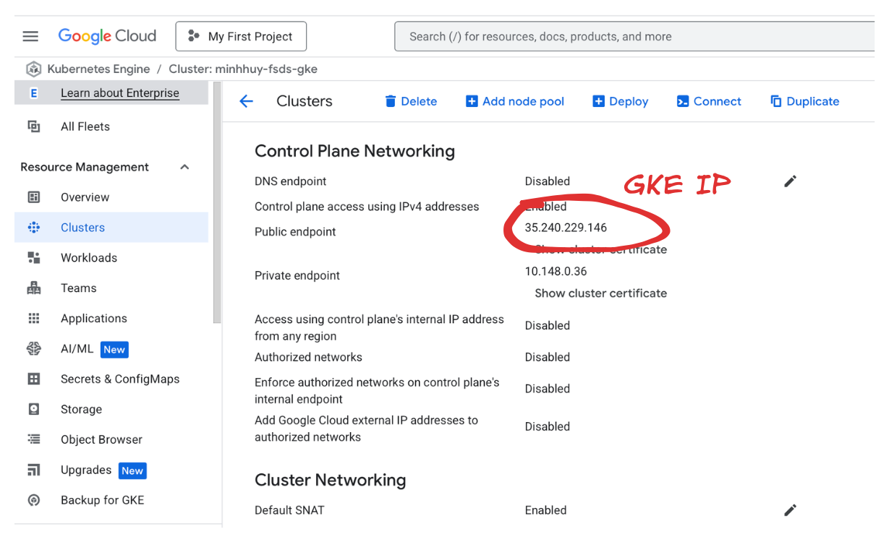

Then, run the command below to list your GKE information. Search your cluster using Cluster IP.
```
cat ~/.kube/config
```


Finally, fill the missing field in Jeknins Cloud setting
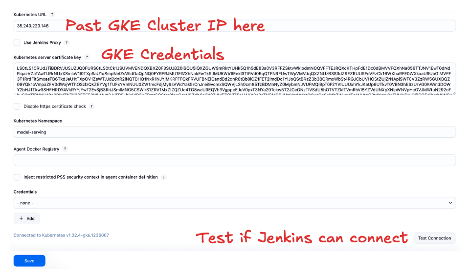


### c. Create CI/CD pipeline

**Create CI/CD pipeline**
First create a new Github access token at github -> Account -> settings -> Developer settings -> Personal Access tokens -> Tokens classic, create a new one.
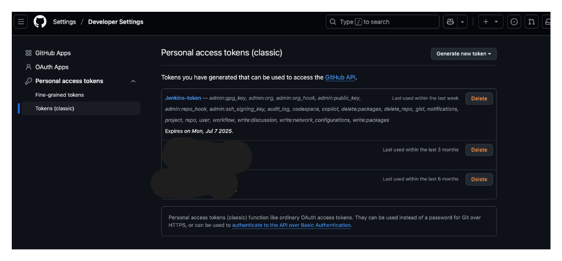

Go to Jenkins -> New Item -> Create a Multibranch pipeline with a name "prompt-guardrail-service". In the configuration page, go to "Branch Sources" -> Add source github.
1. Create a new credentials, using our github access token.
2. Copy our github repo  and past to to the github HTTPs URL.
After that, click validate if Jenkins can access the repo. Click apply and save.
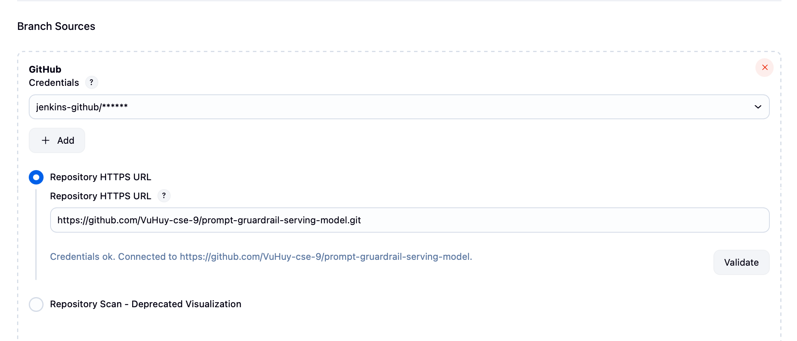


**Create Github Webhook**: Go to your repository, click settings -> Webhooks -> Add webhooks -> Past your VM instance External IP with the format `http://<VM_External_IP>:8081/github-webhook/`:
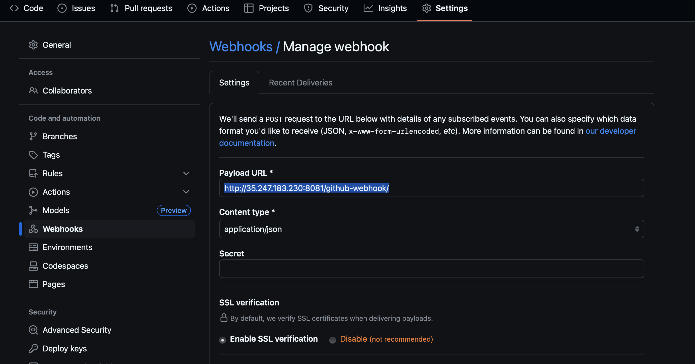

### d. Setup docker credentials.
Currently, our docker image is in public state. If you docker image is private, you can setup a docker credential so that Jenkins can access your private docker image.

First, get your docker access token following this [instruction](https://docs.docker.com/security/for-developers/access-tokens/).

Then, in Jenkins UI, go to Manage Jenkins ->  Credentials -> Stores scoped to Jenkins -> System -> Global Credentials -> Add Credentials. Fill in all the field, where Password is your docker access token. for the id, you should set it with: `docker-hub-credentials`. Then, click create.
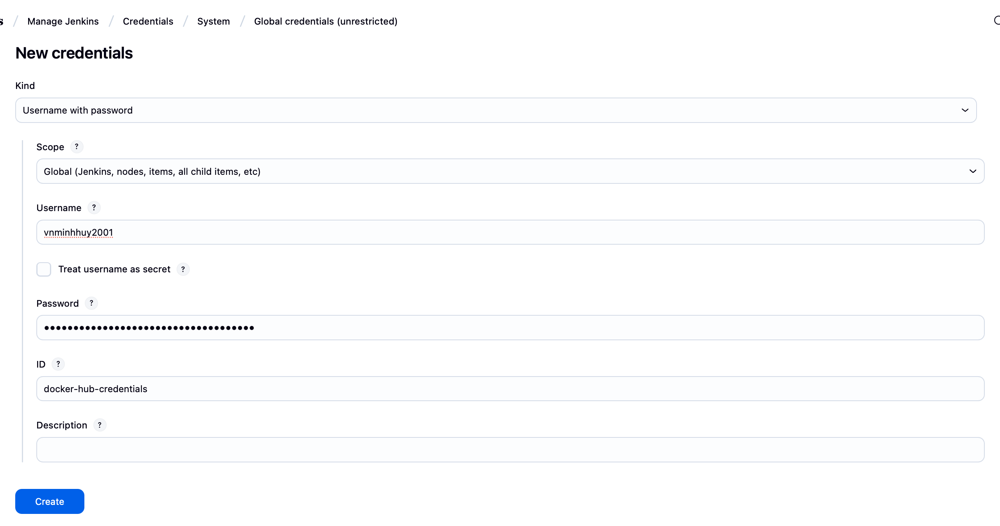

Now, you have completed setting up Jenkins.

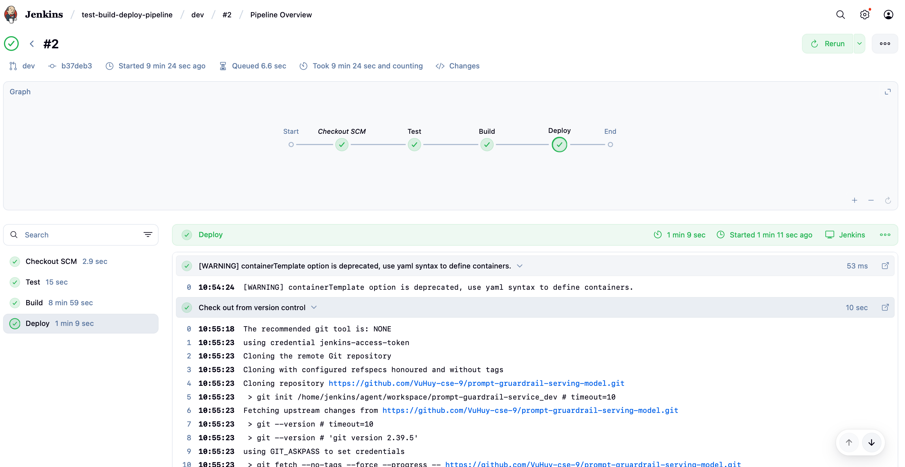